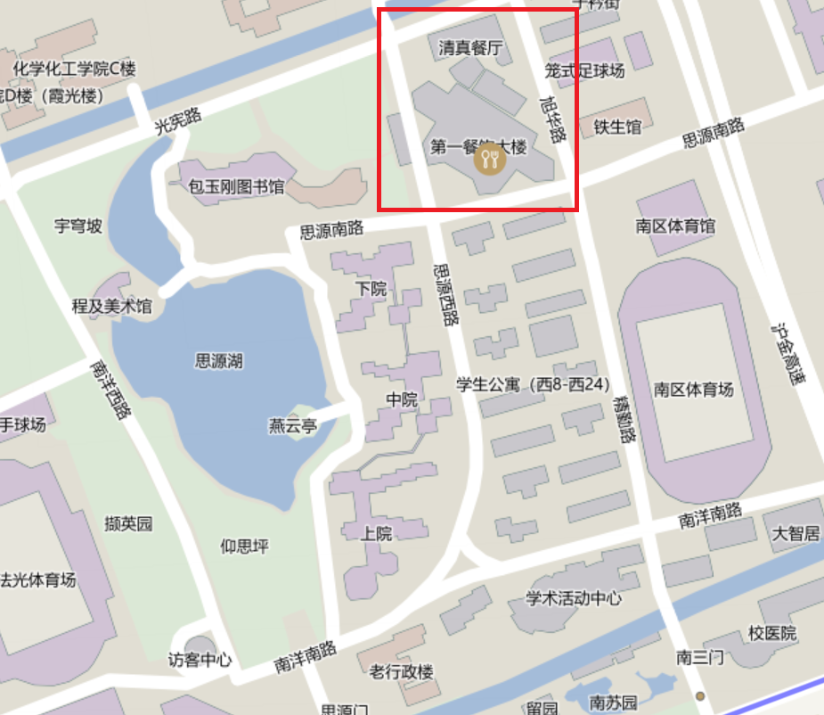
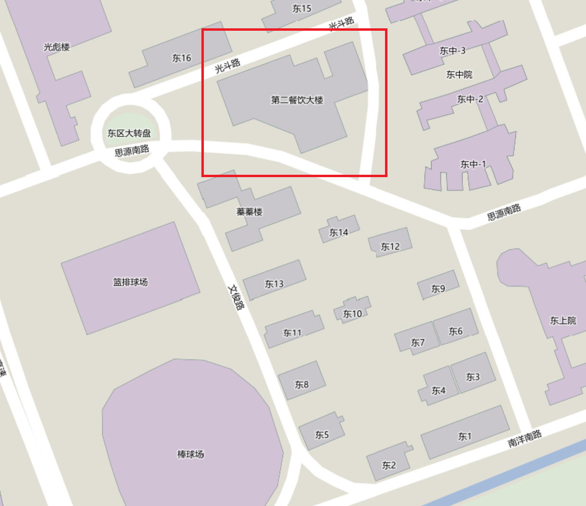
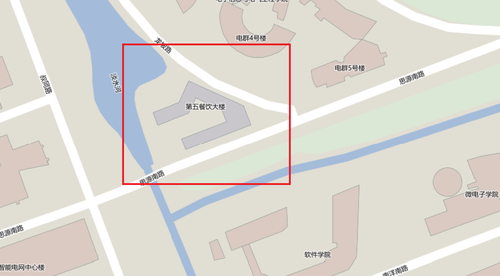
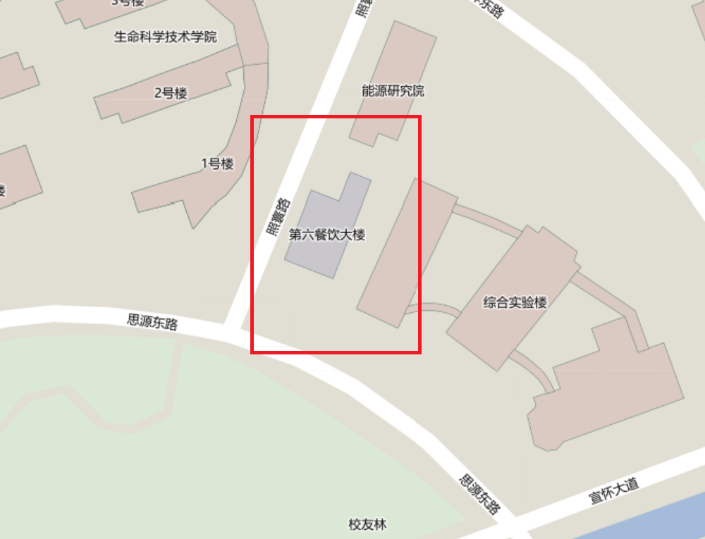
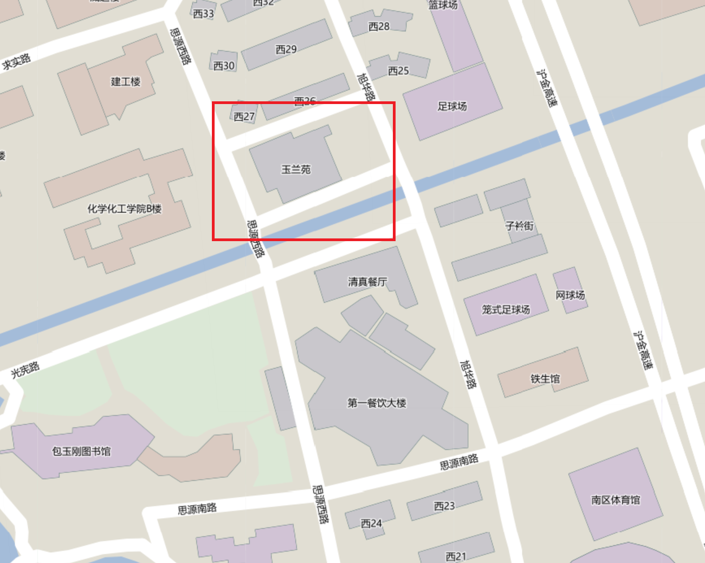
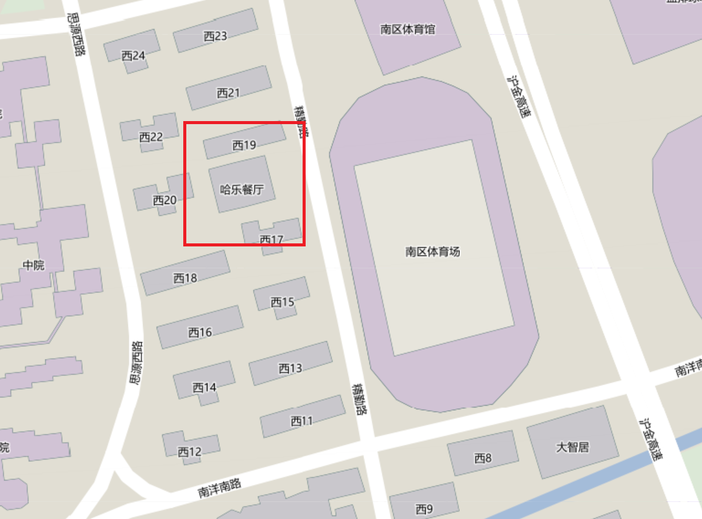

# 餐饮

> 翰因见秋风起，乃思吴中菰菜、莼羹、鲈鱼脍，曰：“人生贵得适志，何能羁宦数千里以要名爵乎！”遂命驾而归。
——《晋书·张翰传》

千百年来，关于美食的记忆永远能扰动人们内心最脆弱的情感。远方的莼羹鲈脍挑动着张翰的思乡之情，而交大的食堂或许也能在远走他乡的忙碌生活中，带给同学慰藉。

## 第一餐饮大楼
- 地址

### 1F餐厅
### 2F教工餐厅
### 2F自选餐厅
### 清真餐厅
### 麦当劳
### 校园咖啡
## 第二餐饮大楼
- 地址

### 1F大众餐厅
### 1F西式餐厅
### 2F教工餐厅

+ 教工的菜是小碟的。虽说笔者在其短暂的大学生涯中对前往教工吃午饭有莫名的执着，但教工却并没有足以让笔者将其单列介绍的“大菜”，也没有在众食堂中独树一帜的特色菜。然滋味虽不惊艳，整体也依旧能稳稳落在“人间烟火”的及格线上。
+ 教工的菜以素食为主。水蒸南瓜，清炒土豆丝，炒青菜···`清淡`似乎是教工食堂的主题。在这能找到的最重口调味的菜，大抵是老家上海的笔者也品尝不出辣味的毛血旺。
+ 总之，笔者认为，教工可以是素食主义者的福音。而对于无肉不欢，喜食辛辣的同学，教工的水蒸清炒难灭会有些许寡淡。
+ 人均消费: ____

### 2F大众餐厅
### 2F陈香贵牛肉面
### 3F绿园餐厅
### 1F优C高麦
## 第三餐饮大楼
- 地址

### 1F餐厅
### 2F外婆桥
### 2F清真餐厅
### 瑞幸咖啡
## 第四餐饮大楼
- 地址

### 1F餐厅
### 2F餐厅
### 吉姆丽德
## 第五餐饮大楼
- 地址

### 1F餐厅
### 1F东湖面馆
### 2F教工餐厅
### 2F无田有果
### 2F大众餐厅
### 吉姆丽德
### 校园咖啡
## 第六餐饮大楼
- 地址

### 1F餐厅
### 2F智慧餐厅
### 伊诺咖啡
## 第七餐饮大楼
- 地址

## 玉兰苑
- 地址

### 1F餐厅
### 2F一等茶餐厅
### 1F串府
### 1F饼家
### 1F餐堡
### 1F厝内小眷村
## 哈乐餐厅
- 地址

## 西区其余
### 霸王茶姬

## 智慧能源学院内
### 肯德基