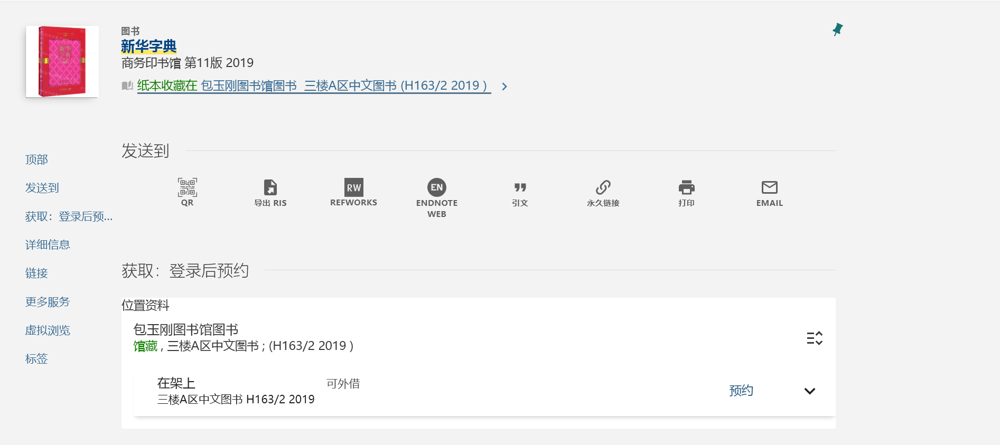

# 图书馆

## 借阅
首先查看[借阅规则](https://www.lib.sjtu.edu.cn/f/content/detail.shtml?id=1830&lang=zh-cn)。
教职工计划内学生可以外借无数本书，每次外借周期30天，快到期时可续借。
在此推荐直接通过[上海交通大学图书馆](https://www.lib.sjtu.edu.cn/f/main/index.shtml)网站搜索你想借阅的书籍，查询书籍空闲情况，在网站上提交预约。会有馆员帮你取，只需等待邮件通知，就可在你选定的取书图书馆的预约区借阅你想要的图书。(就算在闵行，也可以预约借阅徐汇的书哦，反过来也行)

### 自助借阅
如果你十分急迫，并且恰巧你想借阅的书在你所能到达的图书馆，也可以尝试自助借阅。
通过[上海交通大学图书馆](https://www.lib.sjtu.edu.cn/f/main/index.shtml)查询借阅书籍所在的地点，确认借阅书籍没有被预约。

这里以新华字典为例，可以看到，该书在包玉刚图书馆三楼A区。
那么H163/2 2019是什么，在这里不妨了解一下索书号的构成。

- 索书号
分为分类号、种次码或著者码、辅助区分号。例如这里H163就是分类号，2是种次码或著者码，2019是辅助分区号。
索书号的排列采用逐行排列的方式，即先按照分类号排列，再按照种次码或著者码排列，最后按照辅助区分号排列，其中：
（1）分类号采用小数制排列，自左至右逐一排列组成分类号的字母或数字，如K1排在K209前面，K102排在K3前面。
（2）其他号码采用整数制排列，即按照作为一个整数的大小进行排列，如K209/31排在K209/56前面，K209/5排在K209/16前面。

前往包玉刚图书馆三楼A区，找到包括H163的书架。需要注意H16后面是H161并非H17。跳跃观察书架上书的索书号，寻找H163/2附近的索书号，在此附近仔细寻找，直至找到该书。
存在一定可能找不到该书，有可能是书被图书馆里的人拿走了，亦或是刚归还，馆员还未将图书上架。此时选择预约借阅可能是最好的解决方案。
找到书籍后，前往自助借还机或人工柜台，借阅图书。

## 归还
大部分图书均可异馆归还，只需前往离你最近的上海交通大学图书馆归还即可。